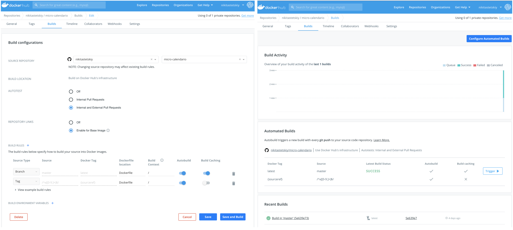
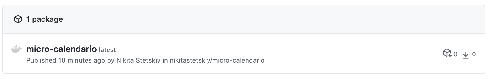
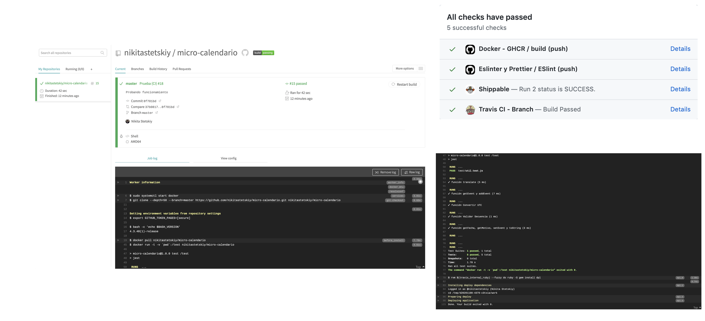
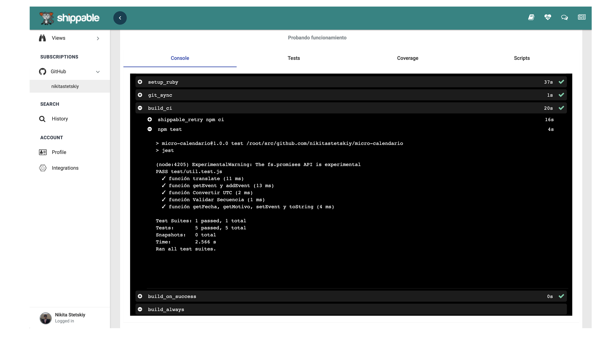
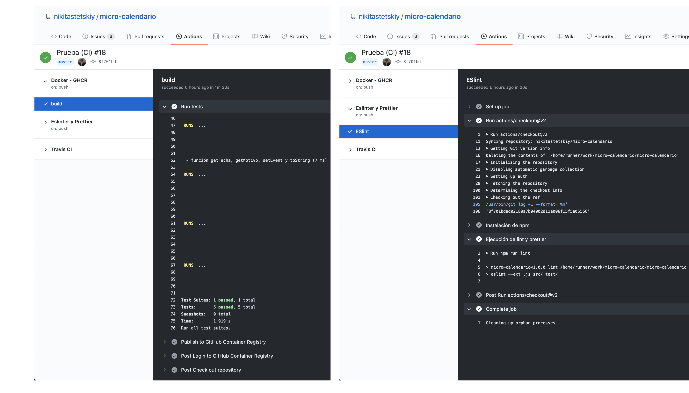
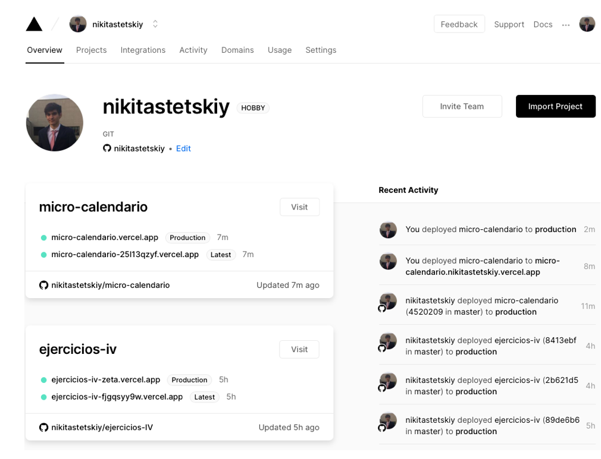
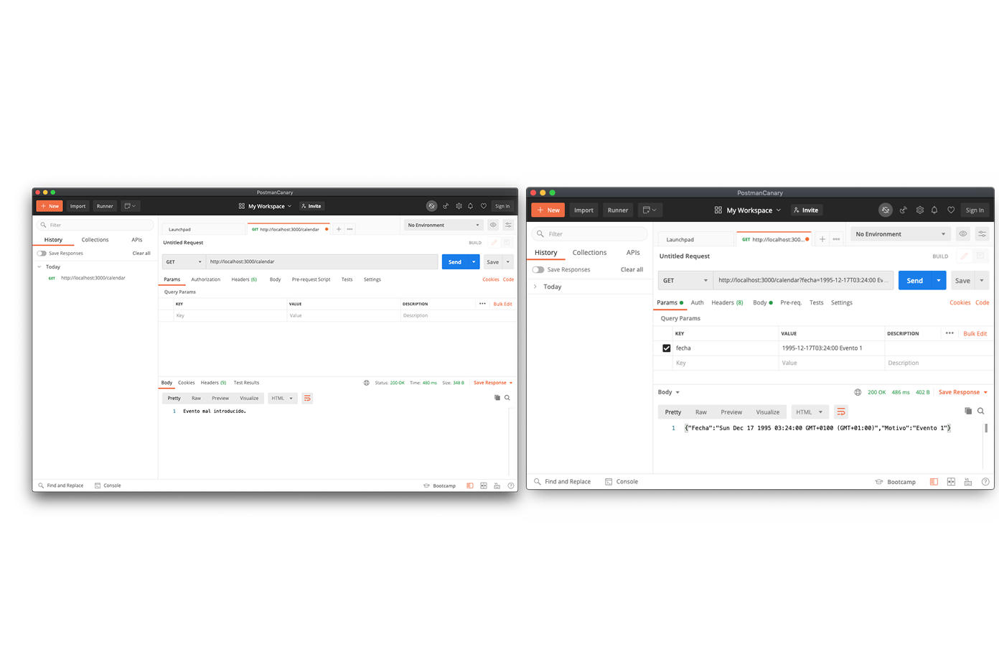
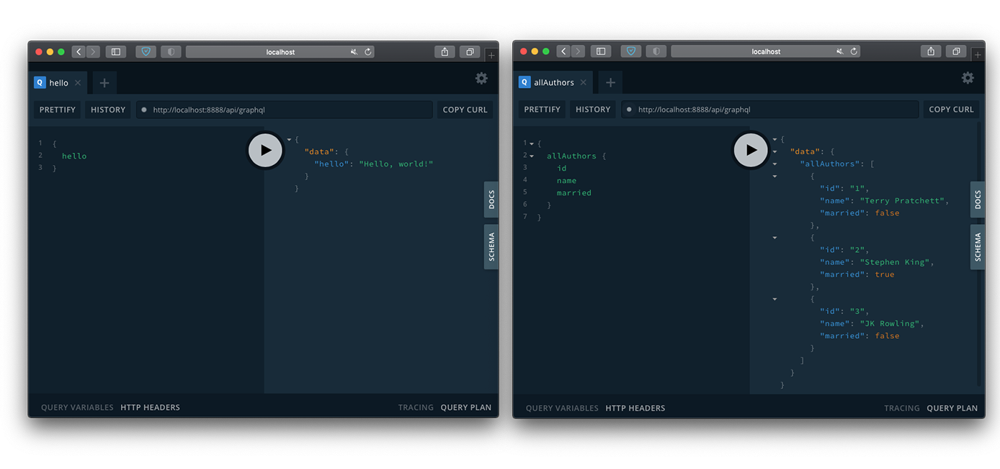
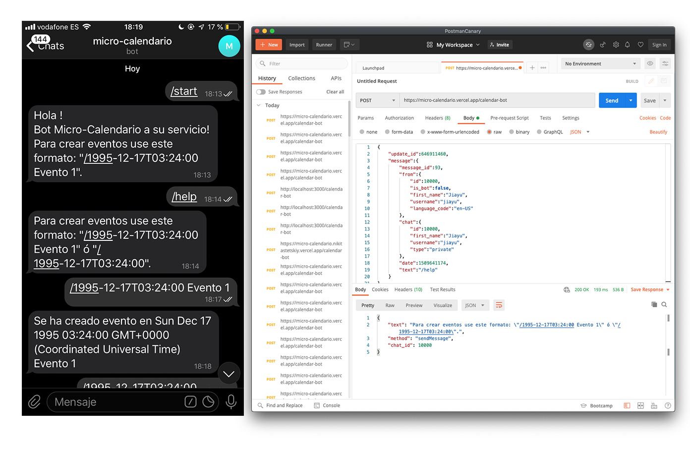

# Micro Calendario

> Proyecto que pertenece a la asignatura Infraestructura Virtual (IV).
>  
>
>  

## Descripción

Esta API web se basará en la consulta de eventos. He elegido este problema, porque tengo muchas complicaciones a la hora de organizar fechas. Así que he pensado que la mejor solución sería un bot personal de telegram, dónde puedas crear eventos y consultar los mismos de una manera eficiente.

Para poder instalar la aplicación emplearemos los siguientes comandos. Es necesario tener [node](https://nodejs.org/) instalado para poder ejecutar los comandos `npm`:

    npm install

> Para instalar las dependencias del proyecto.

    npm test

> Para _testear_ el proyecto.

    npm run lint

> Para ejecutar _Eslint_ y _Prettier_ en el proyecto.

## Documentación

En el [plan del proyecto](/docs/plan.md) se desarrollará toda la información correspondiente a la planificación del proyecto y las distintas entregas. Se explicarán las pautas seguidas, la creación y la configuración de diferentes ficheros.

Aun así, a continuación puede disponer de toda la información esencial del proyecto:

<b>Lenguaje de programación</b>

<dl>
    <dd> <blockquote> 
    He utilizado <code>Javascript</code>, ya que es un lenguaje ampliamente popular y que para mí es totalmente nuevo. Aunque por lo que he podido leer es un lenguaje bastante sencillo, rápido y muy versátil. Otra de sus famosas ventajas es que es multiplataforma y además es muy útil para desarrollar páginas dinámicas y aplicaciones web.
      
    Todo lo relacionado con esta explicación se encuentra en <a href="docs/herramientas.md">este enlace</a>.
    </blockquote> </dd>
</dl>

<b>Gestor de paquetes</b>

<dl>
    <dd> <blockquote>
     
    He elegido <code>Npm</code>, el cual es el gestor por defecto para <code>Node.js</code> y además un entorno de ejecución para <code>Javascript</code>. También lo he utilizado como herramienta de construcción, además este gestor funciona a través de un fichero <code>JSON</code>, ya que se realiza un seguimiento de módulos instalados. En este fichero se contendrá información del proyecto, tal como el nombre, descripción, autor, etc.
      
    De momento es una <em>herramienta</em> de construcción muy simple, dispone de funciones que por ahora abarcan todas nuestras necesidades, tales como instalar las distintas dependencias, módulos, paquetes y la ejecución de scipts, que por ahora solamente es <em>testing</em>. Además su metodología de programación es bastante sencilla, funciona como ya dije junto con un fichero <code>JSON</code>, el cual contiene:
     
     
    <ul>
        <li>Todos los módulos necesarios para un proyecto y sus versiones instaladas.</li>
        <li>Todos los metadatos de un proyecto, como el autor y la licencia, entre otros.</li>
        <li>Secuencias de comandos que se pueden ejecutar para automatizar tareas del proyecto.</li>
    </ul>
    Los archivos <code>JSON</code> correspondientes: <a href="/package.json"><code>package.json</code></a> y <a href="/package-lock.json"><code>package-lock.json</code></a>.
      
    Todo lo relacionado con esta explicación se encuentra en <a href="docs/herramientas.md">este enlace</a>.
    </blockquote> </dd>
</dl>

<b><em>Testing</em></b>

<dl>
    <dd> <blockquote>
     
    <em>Si no está 'testeado', está roto</em>. Para llevar a cabo los test, he escogido <code>Jest</code>, el cual es un marco de prueba de JavaScript bastante sencillo de entender. <code>Taskfile</code> apuntará a <a href="/test/util.test.js"><code>util.test.js</code></a>, el cual será ejecutado mediante <a href="/package.json"><code>package.json</code></a>. <code>JSON</code> interviene en esta sección mediante la gestión de la instalación de dependencias con el comando <code>npm install --save-dev jest</code>. Se tendrá que modificar la parte de <em>scripts</em> para poder ejecutar <code>npm test</code>.
      
    No podemos considerar a los <em>test</em> como una <em>herramienta</em>, ya que se interpreta a los test como parte integral del proceso de desarrollo y el código. Aun así, <code>Jest</code> es un framework de testing generalista que podemos utilizar en cualquier situación, en el cual podemos crear, ejecutar y estructurar pruebas. El lado positivo de estas pruebas es que puedes tener control sobre el funcionamiento de lo que estás creando, puedes incluso realizar diferentes tipos de pruebas a un mismo bloque de código y de esta manera puedes saber que tan susceptible es esa parte de código.
      
    La principal ventaja es que supone un buen flujo de trabajo con <code>Npm</code> y <code>Node</code>. Además posee una gran documentación y comunidad, lo cual hace más fácil y ágil su aprendizaje. Tampoco hace falta una biblioteca de aserciones, ya que está incluida.
      
    Todo lo relacionado con esta explicación se encuentra en <a href="docs/herramientas.md">este enlace</a>.
    </blockquote> </dd>
</dl>

<b><em>Docker</em></b>

<dl>
    <dd> <blockquote>
         
        Se ha creado el <a href="/Dockerfile">Dockerfile</a> y <a href="/.dockerignore">.dockerignore</a> siguiendo las <a href="https://docs.docker.com/engine/reference/builder/">recomendaciones de buenas prácticas</a>. También se ha creado la <a href="https://hub.docker.com/r/nikitastetskiy/micro-calendario/builds">build</a> correspondiente en mi perfil de <a href="https://hub.docker.com/u/nikitastetskiy">Dockerhub</a>.
          
        Estos son los contenedores que he podido probar localmente:
          
        <table style="width:100%">
        <tr>
            <td><b>Contenedor Base</b></td>
            <th>Tiempo de Construcción</th> 
            <th>Tiempo de Ejecución (<em>testing</em>)</th>
            <th>Tamaño</th>
        </tr>
        <tr>
            <td><b>node:14-stretch</b></td>
            <th>109.3s</th> 
            <th>14.91s</th>
            <th>978MB</th>
        </tr>
        <tr>
            <td><b>node:14-buster</b></td>
            <th>26.7s</th> 
            <th>15.884s</th>
            <th>947MB</th>
        </tr>
        <tr>
            <td><b>alpine:3.12</b></td>
            <th>12.4s</th> 
            <th>13.592s</th>
            <th>90.5MB</th>
        </tr>
        <tr>
            <td><b>node:14-slim</b></td>
            <th>14.2s</th> 
            <th>14.382s</th>
            <th>202MB</th>
        </tr>
        </table>
         
        Al principio he usado <em>buster</em> y la versión stretch, ya que son contenedores que lo tienen todo, aunque <em>buster</em> más nuevo, debido a que es la versión Debian 10. Al ser por así decirlo una versión genérica te incluye todas las necesidades, aunque el tiempo de construcción y el tamaño es bastante desfavorable. Por lo que me he inclinado en versiones más slim, en la cual la más ventajosa es <em>14-slim</em>, ya que tarda muy poco en construirse y el tamaño de la imagen también es bastante pequeño, aun así, incluye todo lo necesario para el funcionamiento. También he utilizado una versión no oficial que incluía únicamente node (<em>mhart/alpine-node:slim</em>).
          
        Aunque finalmente me he decantado por la versión Alpine, ya que es muy ligera, pese a que utiliza <code>/bin/sh</code> como shell, <code>apk</code> como packagemanger y algunas librerías inusuales. Esta imagen es mucho mejor, ya que aunque hayamos quitado YARN en como mejora de optimización en node:14-slim (<a href="https://github.com/nikitastetskiy/micro-calendario/commit/fd7b952d3767baa59aa3693af82a2eec1605ef88">aquí el commit correspondiente</a>), la imagen ubuntu sigue ocupando bastante espacio. Por lo que al utilizar alpine, su última versión disponible, nos ahorramos bastante espacio. También borramos la caché y los archivos <code>JSON</code> innecesarios.
          
        Se ha utilizado node como usuario, ya que no se necesita realizar instalaciones como superusuario, todo esto por motivos de seguridad. Posteriormente se ha utilizado también una optimización de la imagen limpiando la caché de npm, además de hacer un clean install. También se ha removido archivos no necesario, como los <code>JSON</code>. Otros ejemplos de optimización vienen siendo el uso de herramientas como squash o podman.
          
        <h3>DockerHub</h3>
        Se ha configurado y automatizado DockerHub:
          
        
          
        <h3>GitHub Container Registry</h3>
        Se ha configurado y enlazado <a href="https://github.com/nikitastetskiy?tab=packages&repo_name=micro-calendario">GHCR</a>:
          
        
          
        Ejecución y prueba:
          
        

<pre class="highlight"><code>
        docker pull nikitastetskiy/micro-calendario
         
        docker run -t -v `pwd`:/test nikitastetskiy/micro-calendario
        </code></pre>

         
        Si usamos GitHub Container Registry:
          
        

<pre class="highlight"><code>
        docker pull ghcr.io/nikitastetskiy/micro-calendario:latest
         
        docker run -t -v `pwd`:/test ghcr.io/nikitastetskiy/micro-calendario:latest
        </code></pre>

         
        Todo lo relacionado con esta explicación se encuentra en <a href="docs/herramientas.md">este enlace</a>.
    </blockquote> </dd>
</dl>

<b>Integración continua (Travis, Shippable y GitHub Actions) </b>

<dl>
    <dd> <blockquote>
    <ul>
     
        <li><code>Travis</code>: se ha configurado el <a href=".travis.yml">fichero travis</a>, siguiendo las <a href="https://docs.travis-ci.com/user/languages/minimal-and-generic/#minimal">buenas prácticas</a>, de tal manera que pueda ejecutar los test junto al docker que ya teníamos implementado anteriormente. También se ha añadido una pequeña integración continua en el mismo archivo, esto se realiza mediante <code>deploy</code> y pages, el cual hace que se me actualice <a href="https://nikitastetskiy.github.io/micro-calendario/">gh-pages</a> autómaticamente.</li>
        
        <li><code>Shippable</code>: se ha configurado el <a href="shippable.yml">fichero shippable</a> de una manera muy parecida a travis, pero ahora en vez de utilizar el docker, se ha utilizado directamente node para comprobar los test.</li>
        
        <li><code>GitHub actions - workflow</code>: se ha configurado el <a href=".github/workflows/ghcr.yml">fichero ghcr</a> y el <a href=".github/workflows/lint-prettier.yml">fichero linter-prettier</a>. El fichero ghcr se ha utilizado para publicar un paquete docker en la parte de packages de github, testea el contenedor docker y se publica. El fichero linter-prettier se usa para corregir la sintaxis y el estilo del código con reglas definidas por mí y configuraciones generales.</li>
        
        Todo lo relacionado con las pautas de creación y configuración se encuentra en <a href="docs/herramientas.md">este enlace</a>.
    </blockquote> </dd>
</dl>

<b>Sistemas serverless</b>

<dl>
    <dd> <blockquote>
    <ul>
     
        <li><code>Vercel</code>: todo lo correspondiente a la instalación y configuración de Netlify o Vercel se encuentra en el <a href="https://github.com/nikitastetskiy/ejercicios-IV/blob/master/tema%205/README.md">repo ejercicios-IV</a>, aunque lo único que tenemos que hacer es conectarnos con github en la plataforma Vercel. Posteriormente elegir y importar el código fuente de nuestro proyecto. Finalmente para enlazar el proyecto y nuestro directorio de trabajo, lanzamos vercel y lo configuramos, es decir lo <em>linkeamos</em> a nuestra plataforma de Vercel. Así pues cada vez que hagamos push se desplegará en estado production, aunque también podemos desplegarla antes como dev o hacer deploy para tener una preview de su funcionamiento. Gracias a este sistema he podido automatizar las funciones serverless. En su <a href="https://github.com/nikitastetskiy/micro-calendario/issues/19">historia de usuario</a> podemos ver todos los pasos seguidos para que este sistema funcione correctamente. Para su funcionamiento primero me he creado la cuenta y agregado el repositorio de la asignatura. Luego he inicializado Vercel en mi repo y he agregado la carpeta <a href="api">api</a> y el archivo <a href="vercel.json">vercel.json</a> para la configuración. En la carpeta se encuentran las distintas funciones. El archivo de configuración se ha realizado debido a que solo quiero que sean accesibles distintas rutas del proyecto y que solamente se use los métodos GET y POST.
        
        Como función serverless, primero he realizado un <a href="api/hello.js">Hola Mundo</a> el cual también funciona cuando accedemos a la raíz del proyecto. La segunda función devuelve un string en formato JSON con una fecha introducida por el usuario. Aunque la fecha a devolver tendrá un formato diferente al introducido. El archivo <a href="5.json">5.json</a> contiene lo mismo que si hacemos la <a href="https://micro-calendario.vercel.app/calendar?fecha=1995-12-17T03:24:00%20Evento%201">petición a Vercel</a>. El <a href="api/calendar.js">código de la segunda función</a> está comentado y explicado.</li>
        
        <li><code>Netlify</code>: todo lo correspondiente a la instalación y configuración de Netlify o Vercel se encuentra en el <a href="https://github.com/nikitastetskiy/ejercicios-IV/blob/master/tema%205/README.md">repo ejercicios-IV</a>. Aunque igual que en Vercel, para que se nos actualice y haga build en cada push a GitHub lo que tenemos que hacer es registrarnos con nuestra cuenta, inyectar Netlify a nuestro repositorio y una vez hecho esto, inicializamos Netlify en el directorio del repo y <em>linkeamos</em> nuestro proyecto con el que tenemos en Netlify. Para la implementación de Netlify también me he basado en varias funciones, en este caso template, la primera de ellas es un <a href="functions/hello/hello.js">Hola Mundo</a> para poder probar el funcionamiento correcto del intercambio de datos en Netlify. Luego he probado la <a href="functions/protected/protected.js">funcion Protected</a>, la cual devuelve un JSON con el formato de salida "NOT ALLOWED" en caso de no identificar al usuario. He usado el <a href="netlify.toml">redireccionamiento</a> adecuado para esta situación en caso de que se quiera acceder a cualquier otro sitio que no sean las funciones implementadas. Finalmente también he implementado <a href="functions/graphql/graphql.js">GraphQL</a>, el cual nos facilita la consulta y manipulación de datos. He pensado que sería una opción interesante controlar las peticiones desde el cliente y no del servidor, como pasa en Rest. De esta manera podemos definir lo que pedimos. De momento solo están implementadas unas funciones básicas en las que pedimos un query endpoint Hola Mundo y varios types de <em>Autores</em> que ante la petición devuelven un JSON, aunque en un futuro podemos definir esta función para la consulta de eventos por fechas específicas o eventos.</li>
        
        <li><code>Telegram bot</code>: este sistema va a estar compaginado con las funciones implementadas en Vercel. El primer paso es crear el token gracias a Bot Father. El funcionamiento del bot depende de la integración de los webhooks, esta opción es mucho más ventajosa que polling, ya que no estamos constantemente preguntando si hay cambios, sino que la función serverless funcionará cuando se envíe un mensaje. Para integrar el webhook solo tenemos que realizar una petición a esta URL <code>https://api.telegram.org/botTOKEN_BOTFATHER/setWebHook?url=URL_FUNCTION_VERCEL</code>. Sustituir TOKEN_BOTFATHER por el token correspondiente y URL_FUNCTION_VERCEL por la URL de la función, que en mi caso es <code>https://micro-calendario.vercel.app/calendar-bot</code>.
        Aunque para acceder a las funciones del bot solamente es posible con objetos JSON, por lo que si accedemos la URL nos dará un error. Aunque esto es fácil de arreglar con un if al principio del programa que nos compruebe si existe un body o mensaje en sí. Utilizamos el fórmato JSON porque necesitamos saber el ID del chat para que haya un intercambio de mensajes, también el contenido del mensaje y diversos datos como el nombre o la fecha del mensaje. Un ejemplo de JSON sería:
        

<pre class="highlight"><code>
        "update_id":646911460,
        "message":{
            "message_id":93,
            "from":{
                "id":10000,
                "is_bot":false,
                "first_name":"Jiayu",
                "username":"jiayu",
                "language_code":"en-US"
            },
            "chat":{
                "id":10000,
                "first_name":"Jiayu",
                "username":"jiayu",
                "type":"private"
            },
            "date":1509641174,
            "text":"/help"
        }
        </code></pre>

        Aquí puede ver el funcionamiento del bot y la función. Aunque puede probar el bot en <a href="https://t.me/micl_bot">este enlace</a>.
        
        </li>
        Todo lo relacionado con las pautas de creación y configuración se encuentra en <a href="docs/herramientas.md">este enlace</a>.
    </blockquote> </dd>
</dl>

<b>Enlaces a códigos y clases</b>

<dl>
    <dd> <blockquote>
     
    <ul>
        <li>Se ha añadido el fichero <a href="/iv.yaml"><code>YAML</code></a> <em>Ain't Markup Language</em>, con la ruta de la estructura del proyecto y las distintas claves cómo <em>lenguaje</em>, <em>test</em> y <em>taskfile</em>.</li>
        <li>Se ha creado la <a href="/src">carpeta src</a> con distintas clases:</li>
            <ul>
                <li>La primera clase <a href="/src/eventscalendar/events.js"><code>events.js</code></a> del proyecto, encargada de crear los eventos.</li>
                <li>La segunda clase <a href="/src/eventscalendar/planner.js"><code>planner.js</code></a> para poder organizar y gestionar la clase evento.</li>
            </ul>
        <li>El fichero de test, el cual se encuentra en la carpeta <a href="/test">test</a>, bajo el nombre <a href="/test/util.test.js"><code>util.test.js</code></a>.</li>
        <li>Se ha creado el <a href="/Dockerfile">Dockerfile</a> y <a href="/.dockerignore">.dockerignore</a>.</li>
        <li>Los archivos <code>JSON</code> correspondientes: <a href="/package.json"><code>package.json</code></a> y <a href="/package-lock.json"><code>package-lock.json</code></a>.</li>
        <li>Se ha configurado el <a href=".travis.yml">fichero travis</a>, siguiendo las <a href="https://docs.travis-ci.com/user/languages/minimal-and-generic/#minimal">buenas prácticas</a>.</li>
        <li>Se ha configurado el <a href="shippable.yml">fichero shippable</a>.</li>
        <li>Se ha configurado el <a href="/.github/workflows/ghcr.yml">fichero ghcr</a> y el <a href="/.github/workflows/lint-prettier.yml">fichero linter-prettier</a>.</li>
        <li>Se ha configurado el [iv.yaml](../iv.yaml) conforme la URL y el archivo <a href="5.json">5.json</a>.</li>
        <li>Se ha creado la carpeta con las funciones de Vercel <a href="api">api</a>.</li>
        <li>Se ha creado la carpeta con las funciones de Netlify <a href="functions">functions</a>.</li>
    </ul>
    Todo lo relacionado con las pautas de creación y configuración se encuentra en <a href="docs/plan.md">este enlace</a>.
    </blockquote> </dd>
</dl>

<a href="api">api</a>

<b>Enlaces a <em>issues</em>, <em>milestones</em> e historias de usuario </b>

<dl>
    <dd> <blockquote>
    <ul>
     
        <li><a href="https://github.com/nikitastetskiy/micro-calendario/issues?q=is%3Aissue+is%3Aclosed)">En este enlace</a> se encuentran los <em>issues</em> cerrados.</li>
        <li><a href="https://github.com/nikitastetskiy/micro-calendario/milestones?state=closed">En este enlace</a> se encuentran los <em>milestones</em> cerrados.</li>
        <li>Se han añadido las <a href="https://github.com/nikitastetskiy/micro-calendario/milestone/4">Historias de Usuario</a> con su <a href="https://github.com/nikitastetskiy/micro-calendario/issues?q=is%3Aopen+is%3Aissue+label%3Auser-stories">label</a> correspondiente. Aquí se puede consultar las diferentes HU:</li>
            <ul>
                <li><a href="https://github.com/nikitastetskiy/micro-calendario/issues/4">HU1</a>: Consulta de eventos.</li>
                <li><a href="https://github.com/nikitastetskiy/micro-calendario/issues/5">HU2</a>: Consulta específica de eventos.</li>
                <li><a href="https://github.com/nikitastetskiy/micro-calendario/issues/6">HU3</a>: Creación de eventos.</li>
                <li><a href="https://github.com/nikitastetskiy/micro-calendario/issues/14">HU4</a>: Configuración de Docker.</li>
                <li><a href="https://github.com/nikitastetskiy/micro-calendario/issues/16">HU5</a>: Instalación de ESLint y Prettier.</li>
                <li><a href="https://github.com/nikitastetskiy/micro-calendario/issues/17">HU6</a>: Testing.</li>
                <li><a href="https://github.com/nikitastetskiy/micro-calendario/issues/18">HU7</a>: Integración continua.</li>
                <li><a href="https://github.com/nikitastetskiy/micro-calendario/issues/19">HU8</a>: Vercel.</li>
                <li><a href="https://github.com/nikitastetskiy/micro-calendario/issues/20">HU9</a>: Netlify.</li>
                <li><a href="https://github.com/nikitastetskiy/micro-calendario/issues/21">HU10</a>: Telegram bot.</li>
            </ul>
    </ul>
    Todo lo relacionado con las pautas de creación y configuración se encuentra en <a href="docs/plan.md">este enlace</a>.
    </blockquote> </dd>
</dl>

## Enlaces de interés

-   [Herramientas](/docs/herramientas.md): Herramientas que se hayan implementado en el proyecto, dónde se explicará su debido uso y funcionamiento.
-   [IV](https://github.com/JJ/IV-20-21): Repositorio de la asignatura Infraestructura Virtual.
-   [GH Pages](https://nikitastetskiy.github.io/micro-calendario/).

## Autor

Nikita Stetskiy [`github`](https://github.com/nikitastetskiy)