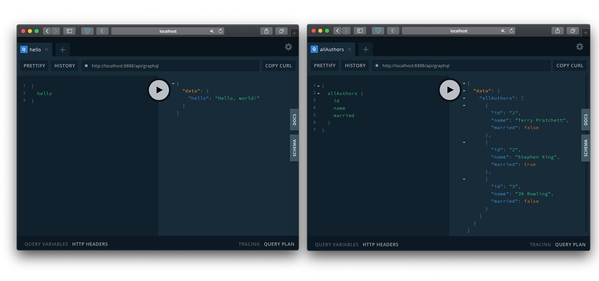
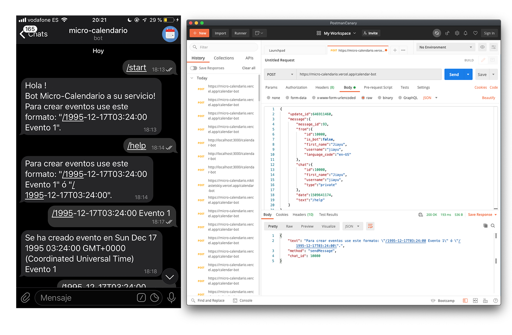

# Herramientas utilizadas o procesos de desarrollo

**Lenguaje**: He utilizado `Javascript`, ya que es un lenguaje ampliamente popular y que para mí es totalmente nuevo. Aunque por lo que he podido leer es un lenguaje bastante sencillo, rápido y muy versátil. Otra de sus famosas ventajas es que es multiplataforma y además es muy útil para desarrollar páginas dinámicas y aplicaciones web.

---

**Base de Datos**: Necesitamos una Base de Datos donde las principales ventajas sean la rapidez de las operaciones y la eficiencia de estas. Aparte de que sean seguras, optimizadas y versátiles.

---

**Gestor de paquetes**: He elegido `Npm`, el cual es el gestor por defecto para `Node.js` y además un entorno de ejecución para `Javascript`. También lo he utilizado como herramienta de construcción, además este gestor funciona a través de un fichero `JSON`, ya que se realiza un seguimiento de módulos instalados. En este fichero se contendrá información del proyecto, tal como el nombre, descripción, autor, etc.

De momento es una _herramienta_ de construcción muy simple, dispone de funciones que por ahora abarcan todas nuestras necesidades, tales como instalar las distintas dependencias, módulos, paquetes y la ejecución de scipts, que por ahora solamente es _testing_. Además su metodología de programación es bastante sencilla, funciona como ya dije junto con un fichero `JSON`, el cual contiene:

-   Todos los módulos necesarios para un proyecto y sus versiones instaladas.
-   Todos los metadatos de un proyecto, como el autor y la licencia, entre otros.
-   Secuencias de comandos que se pueden ejecutar para automatizar tareas del proyecto.

Los archivos `JSON` correspondientes: [`package.json`](../package.json) y [`package-lock.json`](../package-lock.json).

---

**Testing**: _Si no está 'testeado', está roto_. Para llevar a cabo los test, he escogido `Jest`, el cual es un marco de prueba de JavaScript bastante sencillo de entender. `Taskfile` apuntará a [`util.test.js`](../test/util.test.js), el cual será ejecutado mediante [`package.json`](../package.json). `JSON` interviene en esta sección mediante la gestión de la instalación de dependencias con el comando `npm install --save-dev jest`. Se tendrá que modificar la parte de _scripts_ para poder ejecutar `npm test`.

No podemos considerar a los _test_ como una _herramienta_, ya que se interpreta a los test como parte integral del proceso de desarrollo y el código.Aun así, `Jest` es un framework de testing generalista que podemos utilizar en cualquier situación, en el cual podemos crear, ejecutar y estructurar pruebas. El lado positivo de estas pruebas es que puedes tener control sobre el funcionamiento de lo que estás creando, puedes incluso realizar diferentes tipos de pruebas a un mismo bloque de código y de esta manera puedes saber que tan susceptible es esa parte de código.

La principal ventaja es que supone un buen flujo de trabajo con `Npm` y `Node`. Además posee una gran documentación y comunidad, lo cual hace más fácil y ágil su aprendizaje. Tampoco hace falta una biblioteca de aserciones, ya que está incluida.

---

**Docker**: Se ha creado el [Dockerfile](../Dockerfile) y [.dockerignore](../.dockerignore) siguiendo las [recomendaciones de buenas prácticas](https://docs.docker.com/engine/reference/builder/). También se ha creado la [build](https://hub.docker.com/r/nikitastetskiy/micro-calendario/builds) correspondiente en mi perfil de [Dockerhub](https://hub.docker.com/u/nikitastetskiy).

Estos son los contenedores que he podido probar localmente:

| Contenedor Base        | Tiempo de Construcción | Tiempo de Ejecución (_testing_) | Tamaño |
| :--------------------- | :--------------------: | :-----------------------------: | :----: |
| node:14-stretch        |         109.3s         |             14.91s              | 978MB  |
| node:14-buster         |         26.7s          |             15.884s             | 947MB  |
| alpine:latest          |         12.4s          |             13.592s             | 90.5MB |
| node:14-slim           |         14.2s          |             14.382s             | 202MB  |
| mhart/alpine-node:slim |         30.6s          |             12.801s             | 161MB  |

<br>Al principio he usado _buster_ y la versión stretch, ya que son contenedores que lo tienen todo, aunque _buster_ más nuevo, debido a que es la versión Debian 10. Al ser por así decirlo una versión genérica te incluye todas las necesidades, aunque el tiempo de construcción y el tamaño es bastante desfavorable. Por lo que me he inclinado en versiones más slim, en la cual la más ventajosa es _14-slim_, ya que tarda muy poco en construirse y el tamaño de la imagen también es bastante pequeño, aun así, incluye todo lo necesario para el funcionamiento. También he utilizado una versión no oficial que incluía únicamente node (mhart/alpine-node:slim).

Aunque finalmente me he decantado por la versión Alpine, ya que es muy ligera, pese a que utiliza `/bin/sh` como shell, `apk` como packagemanger y algunas librerías inusuales. Esta imagen es mucho mejor, ya que aunque hayamos quitado YARN en como mejora de optimización en node:14-slim ([aquí el commit correspondiente](https://github.com/nikitastetskiy/micro-calendario/commit/fd7b952d3767baa59aa3693af82a2eec1605ef88)), la imagen ubuntu sigue ocupando bastante espacio. Por lo que al utilizar alpine, su última versión disponible, nos ahorramos bastante espacio. También borramos la caché y los archivos `JSON` innecesarios.

Se ha utilizado node como usuario, ya que no se necesita realizar instalaciones como superusuario, todo esto por motivos de seguridad. Posteriormente se ha utilizado también una optimización de la imagen limpiando la caché de npm, además de hacer un clean install. También se ha removido archivos no necesario, como los `JSON`. Otros ejemplos de optimización vienen siendo el uso de herramientas como squash o podman.

### DockerHub

Se ha configurado y automatizado DockerHub:


### GitHub Container Registry

Se ha configurado y enlazado [GHCR](https://github.com/nikitastetskiy?tab=packages&repo_name=micro-calendario):


</br><br>
Ejecución y prueba:
</br><br>

<div class="language-plaintext highlighter-rouge"><div class="highlight"><pre class="highlight"><code>
docker pull nikitastetskiy/micro-calendario
<br>
docker run -t -v `pwd`:/test nikitastetskiy/micro-calendario
</code></pre></div></div>
</br>
Si usamos GitHub Container Registry:
<br></br>
<div class="language-plaintext highlighter-rouge"><div class="highlight"><pre class="highlight"><code>
docker pull ghcr.io/nikitastetskiy/micro-calendario:latest
<br>
docker run -t -v `pwd`:/test ghcr.io/nikitastetskiy/micro-calendario:latest
</code></pre></div></div>
</br>

---

**Integración continua**:

-   `Travis`: se ha configurado el [fichero travis](../.travis.yml), siguiendo las [buenas prácticas](https://docs.travis-ci.com/user/languages/minimal-and-generic/#minimal), de tal manera que pueda ejecutar los test junto al docker que ya teníamos implementado anteriormente. También se ha añadido una pequeña integración continua en el mismo archivo, esto se realiza mediante `deploy` y pages, el cual hace que se me actualice [gh-pages](https://nikitastetskiy.github.io/micro-calendario/) autómaticamente.


-   `Shippable`: se ha configurado el [fichero shippable](../shippable.yml) de una manera muy parecida a travis, pero ahora en vez de utilizar el docker, se ha utilizado directamente node para comprobar los test.


-   `GitHub actions - workflow`: se ha configurado el [fichero ghcr](../.github/workflows/ghcr.yml) y el [fichero linter-prettier](../.github/workflows/lint-prettier.yml). El fichero ghcr se ha utilizado para publicar un paquete docker en la parte de packages de github, testea el contenedor docker y se publica. El fichero linter-prettier se usa para corregir la sintaxis y el estilo del código con reglas definidas por mí y configuraciones generales.


---

**Sistemas serverless**:

-   `Vercel`: lo único que tenemos que hacer es conectarnos con github en la plataforma Vercel. Posteriormente elegir y importar el código fuente de nuestro proyecto. Finalmente para enlazar el proyecto y nuestro directorio de trabajo, lanzamos vercel y lo configuramos, es decir lo _linkeamos_ a nuestra plataforma de Vercel. Así pues cada vez que hagamos push se desplegará en estado production, aunque también podemos desplegarla antes como dev o hacer deploy para tener una preview de su funcionamiento. Gracias a este sistema he podido automatizar las funciones serverless. En su [historia de usuario](https://github.com/nikitastetskiy/micro-calendario/issues/19) podemos ver todos los pasos seguidos para que este sistema funcione correctamente. Para su funcionamiento primero me he creado la cuenta y agregado el repositorio de la asignatura. Luego he inicializado Vercel en mi repo y he agregado la carpeta [api](../api) y el archivo [vercel.json](../vercel.json) para la configuración. En la carpeta se encuentran las distintas funciones. El archivo de configuración se ha realizado debido a que solo quiero que sean accesibles distintas rutas del proyecto y que solamente se use los métodos GET y POST.


Como función serverless, primero he realizado un [Hola Mundo](../api/hello.js) el cual también funciona cuando accedemos a la raíz del proyecto. La segunda función devuelve un string en formato JSON con una fecha introducida por el usuario. Aunque la fecha a devolver tendrá un formato diferente al introducido. El archivo [5.json](../5.json) contiene lo mismo que si hacemos la [petición a Vercel](https://micro-calendario.vercel.app/calendar?fecha=1995-12-17T03:24:00%20Evento%201). El [código de la segunda función](../api/calendar.js) está comentado y explicado. La [tercera función](../api/calendar-bot.js) tiene la misma funcionalidad que la segunda, aunque ahora dedicada para Telegram.

Los despliegues de vercel se pueden comprobar en estas URLs y en [este commit](https://github.com/nikitastetskiy/micro-calendario/commit/dc4e9ac9bd6366f42d68c6f839932e3a0df445c0) como ejemplo:

-   <a href="https://micro-calendario.nikitastetskiy.vercel.app">micro-calendario.nikitastetskiy.vercel.app</a>
-   <a href="https://micro-calendario.vercel.app">micro-calendario.vercel.app</a>
-   <a href="https://micro-calendario-git-master.nikitastetskiy.vercel.app">micro-calendario-git-master.nikitastetskiy.vercel.app</a>


-   `Netlify`: igual que en Vercel, para que se nos actualice y haga build en cada push a GitHub lo que tenemos que hacer es registrarnos con nuestra cuenta, inyectar Netlify a nuestro repositorio y una vez hecho esto, inicializamos Netlify en el directorio del repo y _linkeamos_ nuestro proyecto con el que tenemos en Netlify. Para la implementación de Netlify también me he basado en varias funciones, en este caso template, la primera de ellas es un [Hola Mundo](../functions/hello/hello.js) para poder probar el funcionamiento correcto del intercambio de datos en Netlify. Luego he probado la [función Protected](../functions/protected/protected.js), la cual devuelve un JSON con el formato de salida "NOT ALLOWED" en caso de no identificar al usuario. He usado el [redireccionamiento](../netlify.toml) adecuado para esta situación en caso de que se quiera acceder a cualquier otro sitio que no sean las funciones implementadas. Finalmente también he implementado [GraphQL](../functions/graphql/graphql.js), el cual nos facilita la consulta y manipulación de datos. He pensado que sería una opción interesante controlar las peticiones desde el cliente y no del servidor, como pasa en Rest. De esta manera podemos definir lo que pedimos. De momento solo están implementadas unas funciones básicas en las que pedimos un query endpoint Hola Mundo, varios types de _Autores_ y _Eventos_ que ante la petición devuelven un JSON. De momento no hay una base de datos, por lo que todas las peticiones se realizan en dicha función.
    
    
    Como resumen, las funciones de Vercel se encuentran en la carpeta ([api](../api)) y son tres, cada una con una funcionalidad diferente (Hola Mundo: [código](../api/hello.js) y [función](https://micro-calendario.vercel.app), Calendar: [código](../api/calendar.js) y [función](https://micro-calendario.vercel.app/calendar?fecha=1995-12-17T03:24:00%20Evento%201), Calendar-bot: [código](../api/calendar-bot.js) y [función](https://micro-calendario.vercel.app/calendar-bot)). Las funciones de Netlify se encuentran en la carpeta ([functions](../functions)) y son tres, cada una con una funcionalidad diferente (Hola Mundo: [código](../functions/hello/hello.js) y [función](https://micro-calendario.netlify.app/api/hello), Protected: [código](../functions/protected/protected.js) y [función](https://micro-calendario.netlify.app), GraphQL: [código](../functions/graphql/graphql.js) y [función](https://micro-calendario.netlify.app/api/graphql)). Las funciones de Netlify se encuentran organizadas cada una en su propio directorio, ya que han sido creadas de esa manera según _create_ y debido que son _templates_.

-   `Telegram bot`: este sistema va a estar compaginado con las funciones implementadas en Vercel. El primer paso es crear el token gracias a Bot Father. El funcionamiento del bot depende de la integración de los webhooks, esta opción es mucho más ventajosa que polling, ya que no estamos constantemente preguntando si hay cambios, sino que la función serverless funcionará cuando se envíe un mensaje. Para integrar el webhook solo tenemos que realizar una petición a esta URL `https://api.telegram.org/botTOKEN_BOTFATHER/setWebHook?url=URL_FUNCTION_VERCEL`. Sustituir TOKEN_BOTFATHER por el token correspondiente y URL_FUNCTION_VERCEL por la URL de la función, que en mi caso es `https://micro-calendario.vercel.app/calendar-bot`.
    Aunque para acceder a las funciones del bot solamente es posible con objetos JSON, por lo que si accedemos la URL nos dará un error. Aunque esto es fácil de arreglar con un if al principio del programa que nos compruebe si existe un body o mensaje en sí. Utilizamos el fórmato JSON porque necesitamos saber el ID del chat para que haya un intercambio de mensajes, también el contenido del mensaje y diversos datos como el nombre o la fecha del mensaje. Un ejemplo de JSON sería:

```

{
    "update_id":646911460,
    "message":{
        "message_id":93,
        "from":{
            "id":10000,
            "is_bot":false,
            "first_name":"Jiayu",
            "username":"jiayu",
            "language_code":"en-US"
        },
        "chat":{
            "id":10000,
            "first_name":"Jiayu",
            "username":"jiayu",
            "type":"private"
        },
        "date":1509641174,
        "text":"/help"
    }
}


```

Aquí puede ver el funcionamiento del bot y la función. Aunque puede probar el bot en [este enlace](https://t.me/micl_bot).



---

**Diseño y test de un microservicio**:

He realizado varias comparaciones, pero finalmente me he decidido por Express.js. Para nuestra aplicación he realizado algunos *testeos* con varios frameworks sobre las propias funciones de la aplicación y no un Hola Mundo, incluidos Hapi ([commit correspondiente de la prueba](https://github.com/nikitastetskiy/micro-calendario/commit/5de2d8a98972f1549e300e3e525e54b95bfa5834) y [commit correspondiente del test](https://github.com/nikitastetskiy/micro-calendario/commit/5f0552c52ca1db28a39508c119b04723a6ec4b1e)) y Express ([commit correspondiente de la prueba](https://github.com/nikitastetskiy/micro-calendario/commit/0266d30e9517b7d8720bed53be0c531bd364d4af) y [commit correspondiente del test](https://github.com/nikitastetskiy/micro-calendario/commit/448809af34f99ddaa924bb46dc98d27e91a1cb88)). Ambos frameworks son bastante rápidos (los test han tenido solamente 1 segundo de diferencia) y cumplen con su funcionalidad. Ahora bien, he elegido Express porque después de realizar el mismo test numerosas veces daba mejores resultados que Hapi, esto es posible a que Express guarde en la caché distintas operaciones que hagamos para no tener que repetirlas. Para nuestra aplicación es un factor clave.

Otro factor es que Express utiliza middleware para proporcionar acceso a la canalización de solicitudes / respuestas, es decir, acceso a los objetos de solicitud / respuesta req y res de Node. Una aplicación Express "encadena" el middleware para actuar sobre solicitudes y respuestas. Cada componente de middleware tiene un trabajo único y bien definido que hacer, manteniendo las preocupaciones aisladas dentro de cada componente. Hapi, por el contrario, usa plugins para ampliar sus capacidades. Los plugins se configuran en tiempo de ejecución mediante código. Existen plugins que cumplen con las funciones de middleware aunque los middlewares están diseñados generalmente para hacer cosas como verificar la autenticación entre páginas y los plugins para importar y configurar bibliotecas. Además Hapi generalmente se usa en proyectos más grandes y express para más pequeños, como este. Esto es debido por temas de escalabilidad.

- Se ha configurado un **GET** para [HU1: Consulta de eventos](https://github.com/nikitastetskiy/micro-calendario/issues/4).
- Se ha configurado un **GET** para [HU2: Consulta específica de eventos](https://github.com/nikitastetskiy/micro-calendario/issues/5).
- Se ha configurado un **PUT** para [HU3: Creación de eventos](https://github.com/nikitastetskiy/micro-calendario/issues/6).

Todas las rutas se han configurado en [este archivo](.././src/routes/routes.js). Los test correspondientes en [este archivo](.././test/routes.test.js).

Siguiendo las buenas prácticas, he tomado como referencia la [página de Express](https://expressjs.com/es/advanced/best-practice-performance.html), por lo que para la realización de un registro correcto o logs he usado winston. Ya que el uso de console.log() o console.err() son funciones síncronas cuando canalizan a un terminal o un archivo, por lo que no son adecuadas para producción, a menos que canalice la salida a otro programa. Winston es una biblioteca de registro simple y universal con soporte para múltiples *transportes*. Esto es lo que más me ha llamado la atención, ya que un transporte es esencialmente un dispositivo de almacenamiento. Cada instancia de un registrador Winston puede tener varios *transportes* configurados en diferentes niveles de registro. Winston se ha configurado en [este archivo](.././src/routes/logs/logger.js).

Se ha utilizado middleware gracias a Express. Las funciones de middleware son funciones que tienen acceso al objeto de solicitud (req), al objeto de respuesta (res) y a la siguiente función de middleware en el ciclo de solicitud/respuestas de la aplicación. Se ha usado en el enlace del middleware de nivel de aplicación a una instancia del objeto de aplicación utilizando las funciones app.use() y app.METHOD(), donde METHOD es el método HTTP de la solicitud que maneja la función de middleware (por ejemplo, GET, PUT o POST) en minúsculas.

También se ha configurado Docker para que los test de las rutas funcionen también en Travis y Shippable. Aquí el [issue correspondiente](https://github.com/nikitastetskiy/micro-calendario/issues/24).

---

**Despliegue de una aplicación en un PaaS**:

Comparando varios servicios PaaS, finalmente me he decidido que la plataforma de despliegue para mi aplicación sea Heroku. No he cogido OpenShift porque primero necesita usar PostgreSQL, que en realidad es bastante sencillo de implementar, es más, en este proyecto empecé a usar PostgreSQL y luego tuve que moverlo a MongoDB, aunque esto lo explicaré más adelante. Otra de las limitaciones de OpenShift es que el almacenamiento se expira a los 60 días, algo que en mi aplicación es bastante crucial. También tiene que dormir 18 horas en un periodo de 72h. Mientras que en Heroku tienes un límite de horas por dynos, es decir, que si organizas bien las horas puedes tener un despliegue activo en casi todo el momento. En general, los dynos son mucho más flexibles que las aplicaciones de OpenShift.

Para la configuración de Heroku, me he descargado su *cinturón de herramientas*. Luego he accedido con mis credencias con `heroku login` y he creado un archivo [index](./../index.js) para la ejecución de npm start. Heroku funciona con git, por lo que todos los commits se han reflejado en este [issue](https://github.com/nikitastetskiy/micro-calendario/issues/26) y para subirlo a la plataforma se usa `git push heroku master`. Ahora bien, hay tantos commits probando la ejecución del programa porque básicamente Telegram solo acepta peticiones por https, algo que nos proporciona Heroku y que yo no puedo probar en local. Aunque si se podría con herramientas como Postman Canary. Aun así, index tendría que cumplir el próposito de las rutas creadas anteriormente, aun así he tenido que configurar una ruta de nuevo para el correcto funcionamiento de Telegram, ya que mi intención inicial era crear un bot. Al ser un webhook, solo recibo peticiones post y luego las tengo que diferenciar con los comandos que me proporcione el mensaje del chat.

Finalmente, para la ejecución correcta de mi aplicación he tenido que crear una base de datos con MongoDB Atlas. He elegido esta opción porque principalmente necesitaba una base de datos NoSQL, es decir que haya un objeto por usuario y que ese objeto tenga un array de eventos. A medida que lo estaba haciendo, me encontré con muchos fallos a la hora de implementar la clase, por lo que al final no lo implementé como array, pero continué usando MongoDB. La clase dónde implementé MongoDb se encuentra en [este archivo](./../models/database.js). Para el uso correcto de base de datos, implementé [un script en js](./../scheduled-job.js) dónde lo ejecuto gracias al Scheduler de Heroku. Lo que hago en ese script es recorrer los eventos expirados y enviarlos con una request por https a través de la api de telegram. Este script se puede ejecutar cada hora.

Aquí una prueba del funcionamiento:

